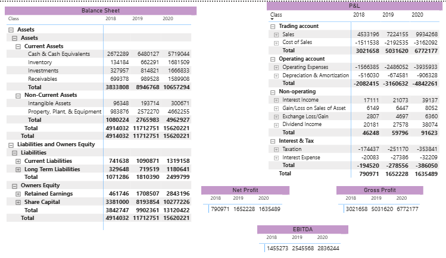
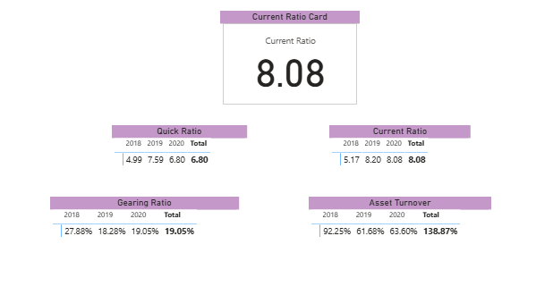
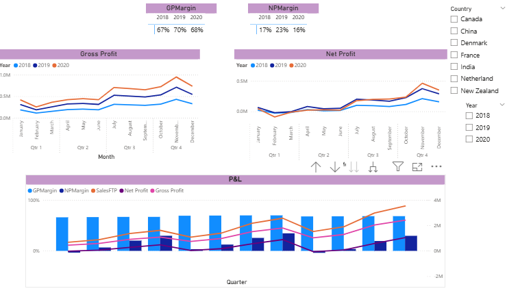

# Power BI Financial Dashboard

## Overview
This project presents interactive Power BI dashboards built using real financial data to analyse
company performance across financial statements, key ratios, and profitability trends.

## Dashboards included
- **Financial Statements Overview:** Balance sheet and profit & loss statements with key profit metrics
  (Gross Profit, Net Profit, EBITDA).
- **Liquidity & Efficiency Ratios:** Current ratio, quick ratio, gearing ratio, and asset turnover.
- **Profitability & Trends:** Time-series analysis of gross profit, net profit, and margins with
  interactive filters.

## Tools
- Power BI
- Financial statement analysis
- Ratio analysis and KPI reporting

## Key visuals

### Financial statements overview

### Liquidity and efficiency ratios

### Profitability and trends

## Author
Nimra Khan

